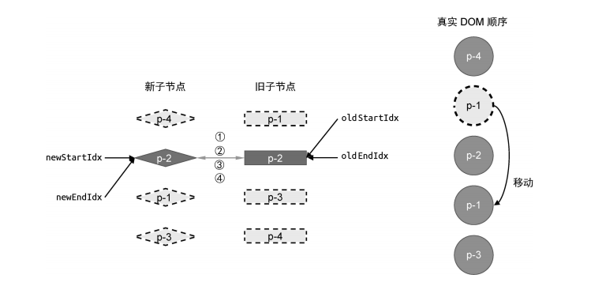
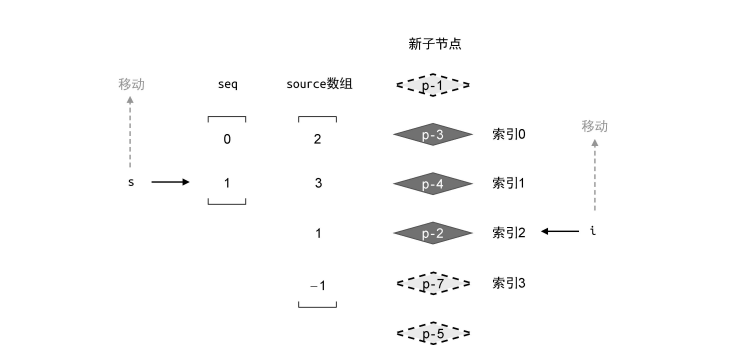

# Vue3的Diff实现

[tag]:Diff|Vue2|Vue3
[create]:2023-08-25

Vue3已经出来挺久了， 而Vue2也将与`2023-12-31`开始停止维护。但是对于Vue3的源码还没有空去详细了解，现在有了空闲，也就有了细读这本书的想法。

整篇书的内容非常详细，从框架设计理念，到具体的响应系统、编译器、渲染器、服务端渲染实现，由浅入深详略得当。如果对Vue最新的实现原理不太了解的话，还是非常推荐阅读的，比看网络文章或视频更全面且有体系，与源码阅读映照着看也能更加容易上手。

也是由于整本书内容庞大，一篇文章的分量也就只能将某个知识点，这既是是自己学习过程中的沉淀，也是再梳理一遍写出来，是一次再学习。后续当有空闲时，也会将其他较为关键的点再整理回顾，加深印象。

Vue3在Diff算法上对比Vue2采用了另外一套算法。这里主要对Vue2与Vue3的算法各自做出解释，并对比两者间的差别。

## 双端Diff算法

Vue2采用的是双端Diff算法。至于为什么要采用这种算法，就得先说明一下一般的Diff算法是怎样的，而双端Diff算法对比其又有什么优点。

### 简单Diff算法

首先，我们先假设我们有两个节点列表，分别为新子节点列表`[p-3, p-1, p-2]`，与旧子节点列表`[p-1, p-2, p-3]`（这里我们就直接跳过当两个节点列表顺序不变的情况了）。如下图所示：

要实现Diff，我们很容易就能想到使用一个双重for循环，找到新节点对应的旧节点，然后进行移动即可。这也是简单Diff算法的基本原理，但是有一点需要注意的是我们的移动都是在同一个容器中移动的，应该怎么根据顺序进行移动呢？以及如何判断一个节点需不需要移动，即它当前所在的位置是不是正确的？

这里我们可以以新节点作为外循环，旧节点作为内循环。然后记下当前已经遍历的新节点在旧子节点列表中的最大索引值，如果当前新子节点的索引值大于最大索引值，则表示顺序是递增的，所以节点位置是正确的不需要移动，然后更新下记录的最大索引值。

但从上述文本叙述中非常难以理解，我们可以辅以图例，如下：

思路依着以下的步骤：
1. 先设置一个最大索引位置的变量`lastChildIndex`用以追踪节点顺序，初始值我们设置为`0`
1. 取新节点`p-3`，并在旧子节点中寻找，发现其在旧子节点中的位置索引为`2`，那么当前`lastChildIndex`设置为`2`，由于上一个值是`0`, `0 < 2` 所以目前节点顺序是递增的，符合我们遍历新子节点的逻辑（从上往下循环），所以不需要移动
2. 继续取下一个节点`p-1`, 其在旧子节点中位置索引为`0`, 但是此时`lastChildIndex`为`2`，`2 > 0`，说明在旧子节点中`p-1`的位置在我们记录的上一个新子节点的位置之前，所以需要移动
3. 那么我们应该移动到哪里呢？因为我们遍历新子节点是从头到尾遍历，所以当遍历到当前节点时，说明上一个节点的位置是确认过正确的，所以我们只需要将当前节点移动到上一个节点的后面
4. 处理了`p-1`，则继续取下一个新节点`p-2`，发现其在旧子节点中的位置索引为`1`, `2 > 1`说明`p-2`也需要移动，依照`p-1`的移动逻辑，将其移动到`p-1`后面

最终我们得到了如下图的DOM结构:

简单Diff算法大致上就是这样，需要额外处理的还有两点：
1. 当新节点在旧节点列表中找不到对应的节点，则执行新增节点的操作，同样是插入到上一个新节点的后面
2. 当新节点遍历完，需要再遍历一遍旧子节点，如果旧子节点没有在新子节点列表中找到对应的节点，说明该节点需要被卸载，则执行卸载操作

以上即完整的简单Diff的一种方案。而双端Diff对比其又有什么优势呢？

### 双端Diff的优势与实现

还是上述的数据为例，思考下图：

简单Diff算法由于只能选择从头到尾或者从尾到头遍历，所以需要移动`p-1`和`p-2`两个节点，但是我们看图很直观就能得出只需要移动`p-3`一次即可。双端Diff则可以解决这种问题。

为了方便演示，我们数据增加一项`p-4`。那么此时新旧子节点如下图所示:

双端Diff算法，顾名思义，就是从数据的两端同时进行Diff。其每一轮遍历包含四次判断:

1. 对比新旧节点的开头节点是否相同，如果相同，则什么都不做，并将两个节点列表的开头索引+1，即都指向下一个节点。如果不相同，则进行下一个判断
2. 对比新旧节点的结尾节点是否相同，如果相同，则什么都不做，并将两个节点列表的结束索引-1，即都指向上一个节点。如果不相同，则进行下一个判断
3. 对比旧节点的开头节点与新节点的结束节点是否相同，如果相同，则移动对应的DOM节点到新结束节点的下一个节点的前面，并且旧节点开始索引+1，新节点结束索引-1。如果不相同，则进行下一个判断
4. 对比旧节点的结束节点与新节点的开始节点是否相同，如果相同，则移动对应的DOM节点到新开始节点的上一个节点的后面，并且旧节点结束索引-1，新节点开始索引+1。如果不相同，则进行下一个判断
5. 除了上述判断之外，如果四个角的节点都没有匹配上，则需要直接在旧节点中遍历搜索对应节点，如果找到则移动节点，并将旧节点列表中对应位置节点清除。如果没有找到则执行新增操作

根据上述逻辑，第一轮Diff后，发现新节点的首个节点与旧节点的最后一个节点相等。则移动DOM到最前面（原本应是新节点的开始节点的上一个节点的后面，但是这里是首个节点，所以直接插到最前面）。并更新索引，进行下一轮Diff。

再进行一轮Diff，发现它们的结束节点相同。根据逻辑，结束节点相同时不需要移动，更新索引再次进行下一轮Diff。

这轮Diff中，新节点的结束节点与旧节点的开始节点相同，所以移动旧节点对应的DOM，将其移动到新节点结束节点的下一个节点`p-3`的前面。注意我们的移动逻辑都是根据新节点的开始与结束节点为锚点的。

最后对比发现新旧节点的开始节点相同，不需要移动，更新索引即可。更新后`newStartIdx > newEndIdx`且`oldStartIdx > oldEndIdx`, 循环终止，刚好节点都Diff排序完毕。

这是比较理想的状态，即新旧子节点个数相同，并且能够一一对应。

### 非理想状态

1. 需要新增节点

当节点对比完旧节点，找不到新节点对应的节点时，则执行新增操作
新增节点除了以上这种状况之外，还有一种情况是每次都命中了四个匹配逻辑之一，最后先把旧节点遍历完了，此时需要退出循环并循环剩下的新节点执行新增操作。

2. 需要删除节点

当遍历完新节点，发现旧节点还没遍历完时(`oldStartIdx <= oldEndIdx`)，需要遍历执行删除操作。

### 相对于简单Diff的优势

如上图，相比简单 Diff 算法，双端 Diff 算法的优势在于，对于同样的更新场景，执行的 DOM 移动操作次数更少。

## 快速Diff算法

Vue3中舍弃了双端Diff算法，采用了全新的快速Diff算法。这是因为经过各项测试发现，快速Diff算法的各项性能都要稍优与双端Diff算法。

如上图（Vue.js设计与实现一书中给出），是两个使用快速Diff算法的框架ivi 和 inferno与vue2的性能对比。

### 预处理

快速Diff算法会先对比新旧两组节点的开头与结尾相同的节点，当遇到不同的节点则立刻停止。即:

1. 从头开始匹配，如果节点相同，则更新DOM的内容，并不需要移动位置。当遇到不同则立刻停止匹配，并转为从尾部开始匹配
2. 从尾部开始向前匹配，如果节点相同，则更新DOM的内容，并不需要移动位置。当遇到不同节点则立刻停止匹配。并根据剩余节点的状态进行不同方式的操作。

3. 如果如上图，旧节点列表先匹配完了，那么剩下的新节点都为新增操作

4. 如果如上图，新节点列表新匹配完了，那么剩下的旧节点都为卸载操作

到这几步为止，都是比较简单的判断逻辑。但是并不是所有数据都是如上数据那么简单的，假如数据如下，中间包含了好几项乱序节点。就需要进入排序处理逻辑了。

### 排序逻辑

首先为了减少计算，我们可以先获取到剩下的乱序节点中的最长递增子序列。

比如我们拥有一个数组`[2, 3, 1, 4, 5]`，那么它的最长递增子序列即是`[1, 4, 5]`。那么获取到这个最大递增子序列有什么用呢？

其实这是用于辅助排序用的，作用也很简单，我们先获取到新子节点中所有节点在旧节点的索引位置，假设索引位置就是我们上面给出的数组`[2, 3, 1, 4, 5]`。那么此时新子节点中的第一个节点在旧节点列表中，是排在第2位。

那当我们遍历新节点列表时，遇到最长递增子序列中的节点时，就不需要移动节点了，就相当于我们拿这个子序列当做是移动的锚点。具体逻辑如下:

首先解释一下上图
- source: 数组内存的是新节点所对应的旧节点在原本旧节点列表的位置，也就是旧索引。
- seq: 最大递增子序列, 这里的值是新节点在新节点的乱序数组中的位置索引。也就是`[p-3, p-4]`在`[p-3, p-4, p-2, p-7]`中对应的索引。

接下来，我们来介绍一下Diff逻辑:

我们新建两个索引值`i`与`s`:
- i: 指向新的一组子节点中的最后一个节点
- s: 指向最长递增子序列中的最后一个元素

1. 先判断`source[i]`是否等于-1? 等于-1则表示其在旧列表中不存在，所以需要执行新增操作。然后将i索引向上移动。

1. `source[i]`是否等于-1? 否
2. 此时`i !== seq[s]`是否成立? 此时`i=2, s=1, seq[s] = 1`, 所以`i !== seq[s]`不成立，表明节点需要移动。（我们上面说过seq是最大递增子序列，里面存的值是节点在乱序新节点列表中的索引，而i也是索引）

那么怎么移动呢？由图示可以知道，我们是从新节点尾部开始向上遍历的。所以我们可以将当前需要移动的节点插入到后一个节点的前面。然后继续将索引i向上移动。

1. `source[i]`是否等于-1? 否
2. 此时`i !== seq[s]`是否成立? 成立，此时i指向的新节点索引为1，而s指向的最长递增子序列中的索引也是1，说明不需要移动。那么我们将索引s与索引i都向上移动。

1. `source[i]`是否等于-1? 否
2. 此时`i !== seq[s]`是否成立? 成立。继续移动索引

到此遍历结束，更新完成。

同时，为了避免嵌套循环新旧节点，我们应该先构建构建新节点的`key: index`的映射关系，然后再循环旧节点，通过`key`生成索引数组`source`。并且当旧节点的key无法在映射关系中找到时，说明需要卸载掉旧节点。

## 总结

至此，快速Diff算法基本上就完整了，其在性能实测中最优也是由于其对新旧节点借鉴了文本Diff中的预处理，先处理两组节点的前置位置与后置位置的节点。然后又排除了纯新增操作与纯卸载操作。最后还取了最长递增子序列来最大程度的减少DOM移动操作。在这几步下来，剩下需要DOM移动更新的频率就会小的多，更不像双端Diff一样，需要新旧两组节点从头到尾遍历一遍。

其实书中有比较多的代码实例，但是这篇文中并没有一段代码，这是因为我觉得理解其中运转逻辑更为重要。假如增加代码实例，令内容更复杂不说，也更难以记忆。况且原本书中代码与最新源码之前也存在一定差异，如果真有需要还是参照着阅读源码更加准确。

[阅读完整版笔记](https://limaosheng.notion.site/vue-75f79c5a7a794610ac6c66fd778028eb?pvs=4)