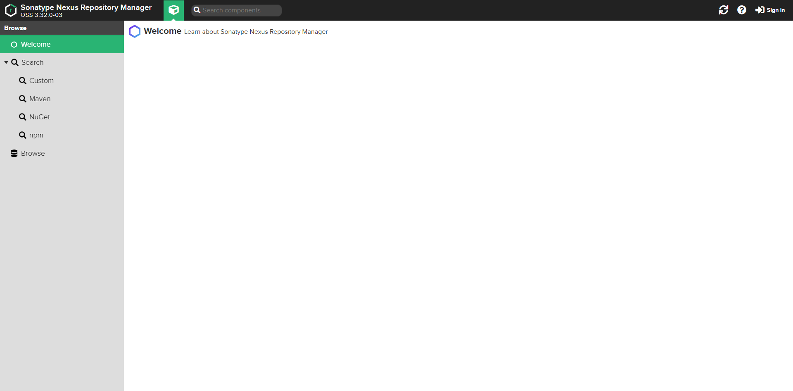
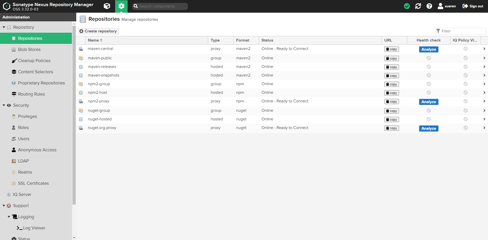
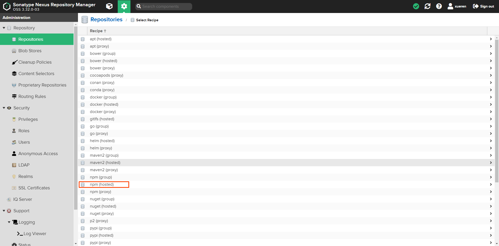
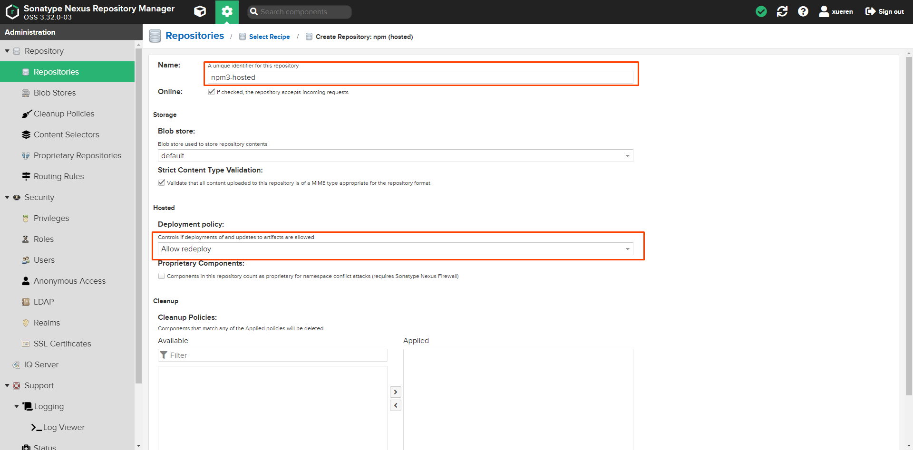
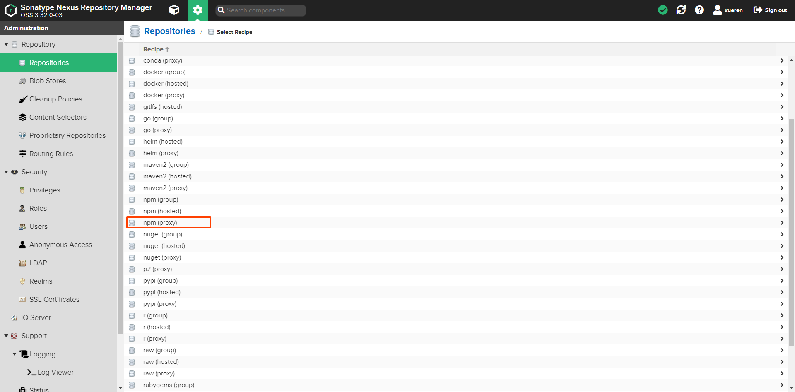
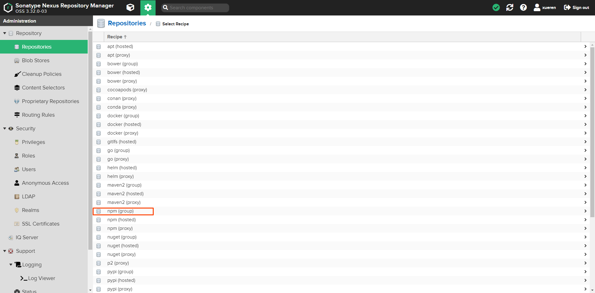
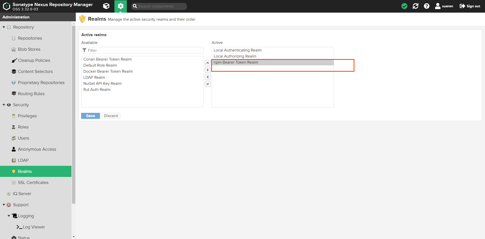
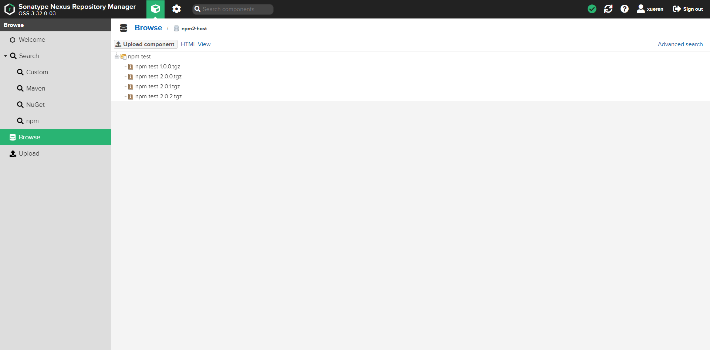

# 使用nexus配置npm私库

[tag]:工程化|私库|npm
[create]:2021-08-12

最近刚入职一个刚成立的公司，团队内“百废待兴”。所以要致富，先修路。想要让前端起飞，那么一个私库是必不可少的。

刚好我最近对前端工程化相关的内容比较感兴趣。自己也学习了一下如何使用nexus搭建私库。关于这方面的资料其实网上不少，不过之前没有将目光投向这些地方，所以自己并不是很了解。

## 使用docker起一个nexus服务

首先得确保你的机器上安装好了docker，然后打开终端跑一下下面的命令（注意把目录映射改一下）:

```sh
docker run -d --name nexus3 --restart=always -p 8081:8081 -p 5000:5000 -v C:\private_npm_lib:/nexus-data sonatype/nexus3
```

- -d: 后台运行容器
- --name: 为容器指定一个名称
- --restart: 当Docker重启时，容器是否自动启动
- -p: 端口映射 **主机(宿主)端口:容器端口**
- -v: 绑定一个卷，就是容器内目录地址与宿主机目录地址映射

容器跑起来之后打开<http://127.0.0.1:8081/#browse/welcome>, 此时可以看到nexus的界面就说明服务启动成功了。



## nexus上配置npm私库

首先我们点击上面界面中右上角的Sign in，然后输入账号: admin, 密码：xxx忘记了xxx后面补上

建议换一个私密一点的，好记的密码。

登录进去之后，我们点击左上角的齿轮icon -> Repository -> Repositories:



然后点击Create repository，先选择新建一个npm hosted



填写name和把deployment policy悬赏Allow redeploy，这是控制是否允许部署和更新。



点击提交，然后回到列表我们再创建一个npm(proxy):



这里我们填上name和remote storage就好了。注意remote storage是当你的私库没有对应的依赖时去哪里安装的地址，我们一般填它的实例，也就是npm的地址就好了，如果你嫌npm太慢也可以选择填淘宝的镜像源<https://registry.npm.taobao.org>

填完点提交就可以了。

再次回到列表我们创建一个npm(group):



这里把name填上，然后在下面把刚刚新建的hosted和proxy都选到右边，然后提交就好了

然后就ok了，我们的私库就建好了。非常的简单

## 使用

怎么使用私库其实也非常的简单，回到我们的仓库列表，如果你是通过上面的命令在本机上开启的服务的话，那么请打开<http://127.0.0.1:8081/#admin/repository/repositories>

找到我们刚刚新建的`npm3-group`，点击它右边的copy按钮，将仓库地址copy下来。

### 只拉取依赖

如果平时不发布私库依赖，仅拉取的话，只需要在项目根目录下增加`.npmrc`文件，并添加以下内容即可:

```sh
registry = http://127.0.0.1:8081/repository/npm3-group/
```

注意将上面的私库地址换成你自己的私库地址

### 全局安装

然后我们可以通过cnpm去全局配置另一个npm命令, 所以我们得先安装cnpm。如何安装cnpm就跳过了，百度一下你就知道。

安装好之后打开终端，输入以下内容回车:

```sh
alias npm3='cnpm --registry=http://127.0.0.1:8081/repository/npm3-group/ --registryweb=http://127.0.0.1:8081/service/rest/repository/browse/npm3-hosted/ --userconfig=$HOME/.npm3rc'
```

然后你就可以像使用npm一样使用npm3了。但是，凡事都得有个但是，window下比较坑的是，alias命令会只在当前的终端起效，如果重开一个终端，或者电脑重启了，那这个命令就没了。

有两个解决方案:

1. 编辑配置git bash的bash.bashrc文件，添加alias命令。它会在每次git bash启动时执行

这个bash.bashrc文件一般在git安装目录下的etc目录下，打开它然后在文件最后面添加:

```sh
alias npm3='cnpm --registry=http://127.0.0.1:8081/repository/npm3-group/ --registryweb=http://127.0.0.1:8081/service/rest/repository/browse/npm3-hosted/ --userconfig=$HOME/.npm3rc'
```

2. 使用nrm进行npm的源管理

nrm是一个npm的源管理工具，它可以比较方便的给npm切换各种源。首先我们需要全局安装nrm：

```sh
npm install -g nrm
```

然后我们添加一个源(注意nrm的1.2.1版本在window中只能在git bash运行，否则会报错，至少在我的机器上是这样):

```sh
nrm add npm3 http://127.0.0.1:8081/repository/npm3-group/ http://127.0.0.1:8081/service/rest/repository/browse/npm3-hosted/
```

然后我们就可以用nrm切换源了:

```sh
nrm use npm3
```

使用方法跟配置命令别名不一样，我们直接使用npm进行依赖安装就好了，此时它的源已经指向了我们的私库.

当然还有另一个方法是我们可以直接配置npm的源地址，使用命令 `npm config set registry 源地址`进行源切换，但是不推荐这样做，因为如果平时是要切换着用的话会很麻烦。

## 发布包

到这里，我们已经部署好了私库，并且已经可以拉取私库里的依赖包进行开发了。但是还没有做到可以上传包，接下来就看看如何开发一个包并上传。

首先我们新建一个项目`npm init`，然后需要在package.json中增加以下内容:

```json
{
  ...
  "publishConfig": {
    "registry": "http://127.0.0.1:8081/repository/npm3-hosted/"
  }
}
```

然后登录(注意这里如果你是使用nrm换源的，将npm3换成npm就好)

```sh
npm3 adduser -registry http://127.0.0.1:8081/repository/npm3-host/
```

输入账号密码(可以在nexus注册一个)

注意这里应该会报一个错误: `Unable to authenticate, need: BASIC realm="Sonatype Nexus Repository Manager"`

这里是没有配置realm的规则，打开nexus上的Security -> Realms，将npm Bearer Token Realm选上。



然后`npm3 publish`就可以了，到这里应该就成功将你的npm包发布到你的私库了.



可以看到我本地的尝试已经正常上传包了。🐂的不行。

拥有私库是每一个有追求的公司的基本条件，只有在拥有私库的情况下才能更好的做沉淀，做工程化，提高开发效率。

The end.
