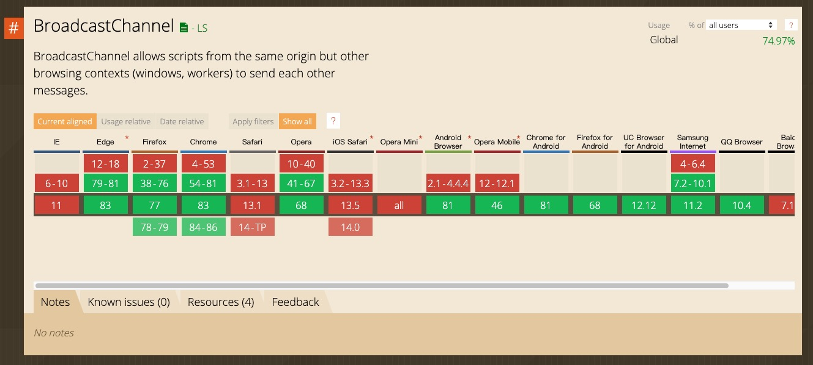
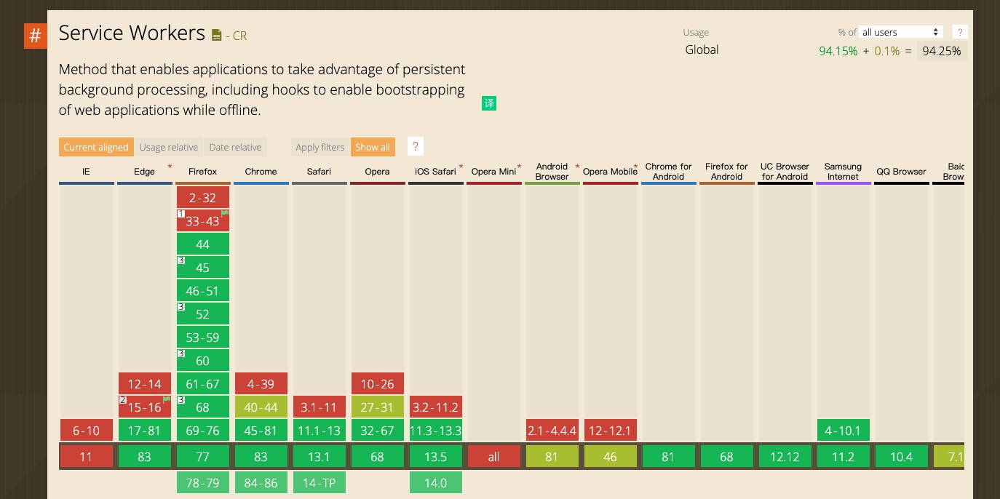
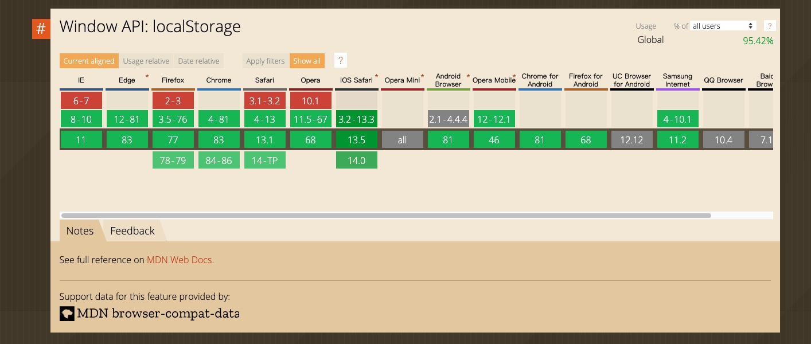
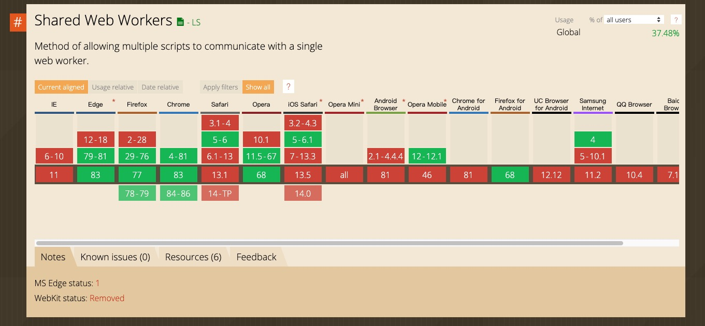

# 多页面间消息通信

[tag]:js|worker|通信
[create]:2020-07-13

> 多tab页间通信又可以根据情况拆分，这里我们只拆分成三种类型的通信“实时通知的通信”，“基于轮训实现的通信”，“跨域的消息通信”

## 实时通知的通信

### BroadCast Channel

BroadCasr Channel可以实现同源下浏览器不同窗口，tab页，frame或者iframe下的浏览器上下文之间的简单通信

一个简单的例子如下：

```html
<ul>
  <li>test1</li>
  <li>test2</li>
  <li>test3</li>
  <li>test4</li>
</ul>
<script>
  var list = [false, false, false, false];
  var lis = document.querySelectorAll('li');
  var bc = new BroadcastChannel('test_channel');
  function update() {
    list.forEach(function(item, index) {
      lis[index].style.backgroundColor = item ? '#ff0000' : '#fff';
    });
  }
  lis.forEach(function(li, index) {
    li.addEventListener('click', function() {
      list[index] = !list[index];
      update();
      bc.postMessage({ index: index, value: list[index] }); // 当点击li时，改变其背景色，并通知其他页面同步更改 （任意类型的对象都可以被发送）
    });
  });
  bc.onmessage = function(ev) { // 监听其他页面广播过来的消息
    var data = ev.data; // 任意类型的对象都可以被发送
    list[data.index] = data.value;
    update();
  };
  // 断开频道连接
  // bc.close()；
</script>
```

如上代码所示，该api设计的用途就是用于同域下多tab页消息通信的，api协议简单，使用起来也比较灵活方便，但最大的问题是其兼容性。


从caniuse我们可以看到，它在安卓机器上兼容良好，但是苹果系统和ie完全不支持，所以除非你的业务不考虑苹果系统和ie，否则还是采取其他的办法好一些

### service worker

service worker通常应用于控制关联的页面或者网站，拦截并修改访问和资源请求，细粒度地缓存资源

要注意的是，service worker本身不具备广播的功能，仅仅只是具备这个能力，所以我们需要编写一个中心化的广播功能。

```javascript
this.addEventListener('message', function(e) {
  e.waitUntil(
    this.clients.matchAll().then(function(clients) {
      if (!clients || clients.length === 0) {
        return;
      }
      clients.forEach(function(client) {
        client.postMessage(e.data);
      });
    })
  )
});
```

以上就是我们的service worker脚本，它简单的仅有一个监听消息的方法，在方法内再将接收到的这条消息广播出去。

接下来则是我们的页面逻辑，页面逻辑主要包括`初始化service worker`，`消息监听`, `向service worker发送消息`。

```javascript
navigator.serviceWorker.register('./sw.js').then(function() {
  console.log('service worker注册成功');
});
navigator.serviceWorker.addEventListener('message', function(e) {
  var data = e.data;
  // 更新页面UI等。。。
});
target.addEventListener('click', function() {
  // 向service worker发送消息
  navigator.serviceWorker.controller.postMessage({ index: 0, value: false });
});
```

这种方式使用起来也比较方便简洁。



从上兼容性上可以看到，比BroadCast Channel要好很多。但是在IE浏览器的不支持，与安卓浏览器上的部分支持，仍然是不够完美的。并且注意的是，它同样也受同源策略的限制。

### localStorage

大家在日常工作中应该都接触使用过localStorage. 但是应该比较少的人同时使用过storage的事件监听（当storage内容发生改变时会触发)。而利用这个监听函数，我们就可以实现同源域名下的多页面通信能力。

代码如下：

```html
<ul>
  <li>test1</li>
  <li>test2</li>
  <li>test3</li>
  <li>test4</li>
</ul>
<script>
  var list = [false, false, false, false];
  var lis = document.querySelectorAll('li');
  function update() {
    list.forEach(function(bool, index) {
      lis[index].style.backgroundColor = bool ? '#ff0000' : '#fff';
    });
  }
  lis.forEach(function(li, index) {
    li.addEventListener('click', function() {
      list[index] = !list[index];
      update(); // 注意setItem的页面并不会收到storage的事件，所以这里需要主动触发一下UI更新
      localStorage.setItem('list', list.join());
    });
  });
  window.addEventListener('storage', function(e) {
    if (e.key === 'list') {
      try {
        list = e.newValue.split(',').map(function(item) {
          return item === 'true';
        });
        update();
      } catch(err) {}
    }
  });
</script>
```


可以看到不论是从兼容性，还是上手难易度。localStorage都是一个极好的选择。仅有的问题也是在其只能传递字符串类型的值，但是将复杂对象使用 JSON 转换一下也是可以克服的。总的来说，问题不大。

### websocket

上面三种方式都是纯前端的方式实现，使用websocket同样能够实现这种状态实时同步的效果，但是其实现起来比较复杂，对于新手不太友好（我也懒得写node代码了。。。）
简单说起来，可以基于websocket这种实时推送的消息传输机制，同步的通知多个页面，进行状态同步，就跟聊天室的原理是一致的。

只要把同一台电脑（可以用ip判断）的socket放到同一个房间就可以了。

### SharedWorker

web worker分为两种，专用worker与共享worker

专用worker仅能被创建它的脚本使用，而共享worker可以被多个脚本使用——即使这些脚本正在被不同的window、iframe或者worker访问
利用共享worker能够被多个脚本共用的特性，我们就可以实现多页面通信的功能了。

页面逻辑如下：

```html
<ul>
  <li>test1</li>
  <li>test2</li>
  <li>test3</li>
  <li>test4</li>
</ul>
<script>
  var list = [false, false, false, false];
  var lis = document.querySelectorAll('li');
  var myWorker = new SharedWorker('shared.js'); // 注意这里路径我本地调试无法使用相对路径，最后修改为绝对路径才没问题
  myWorker.port.onmessage = function(e) {
    var index = e.data[0];
    var value = e.data[1];
    list[index] = value;
    update();
  };
  myWorker.port.start();
  function update() {
    list.forEach(function(bool, index) {
      lis[index].style.backgroundColor = bool ? '#ff0000' : '#fff';
    });
  }
  lis.forEach(function(li, index) {
    li.addEventListener('click', function() {
      myWorker.port.postMessage([index, !list[index]]);
    });
  });
</script>
```

worker逻辑如下：

```javascript
var ports = []; // 这里将每个链接的页面收集起来。收到消息时再遍历广播。
self.addEventListener('connect', function (e) {
    const port = e.ports[0];
    ports.push(port);
    port.addEventListener('message', function (event) {
      ports.forEach(function(port) {
        port && port.postMessage(event.data); // 遍历通知每一个页面
      });
    });
    port.start();
});
```

注意上面这样写有个问题。worker只有connect方法，无法在disconnect的时候将port对象从ports列表中移除，如果打开页面太多，会有内存泄漏的风险。
而在文末的掘金文章里面，采用的是worker内部仅做数据缓存，各页面间轮训查询，这样就基本不需要考虑内存泄漏的问题。


兼容性不行，所以这个方案暂时了解一下，实际业务中应该不太可能使用。

## 基于轮训实现的通信

前面讨论的五种通信形式采用的都是“中心分发消息”的形式处理通信内容的，还有另一种常用的通信方式就是采用轮询的方式定时查询状态。
这种方式往往采用一种同域下单一数据源的数据存储机制存放状态数据，各页面定时查询该数据是否变更来更新页面UI。

如IndexDB, cookie, localStorage, worker等

由于其操作比较简单，设个定时器定时查询就完了。所以不做展开。

需要注意的一个点是，参考资料里的文章内说：

> 在“广播模式”外，我们又了解了“共享存储+长轮询”这种模式。也许你会认为长轮询没有监听模式优雅，但实际上，有些时候使用“共享存储”的形式时，不一定要搭配长轮询。
例如，在多 Tab 场景下，我们可能会离开 Tab A 到另一个 Tab B 中操作；过了一会我们从 Tab B 切换回 Tab A 时，希望将之前在 Tab B 中的操作的信息同步回来。这时候，其实只用在 Tab A 中监听visibilitychange这样的事件，来做一次信息同步即可。

乍一看似乎是没错，但仔细推敲就知道有问题，当你用浏览器分别打开两个tab, 将两个tab页左右放置，这样就不会触发visibilitychange了，而如果同步逻辑仅仅只是放在visibilitychange内，就会无法同步，最后还是要回到轮询的手段。

## 一种不太优雅的形式（window.open && window.opener）

> 当我们使用window.open打开页面时，方法会返回一个被打开页面window的引用。而在未显示指定noopener时，被打开的页面可以通过window.opener获取到打开它的页面的引用 —— 通过这种方式我们就将这些页面建立起了联系（一种树形结构）。

当我们收集且维护起这种树状结构，我们就可以使用它进行整个机构树内的数据同步。但是这样一来费时费力，而来无法同步结构树之外的页面（如直接搜索打开，或者从其他入口进入）
所以了解有这种形式就足够了。

## 跨域的消息通信

以上的多页面间数据同步都是指同域下的页面间通讯，而往往在一些复杂一点的业务中，不同域之间的两个页面也会有数据同步的需求。

而对于这种场景，我们可以采用iframe + 任意一种通信方式相结合来达到目的。

页面与内嵌的iframe间通信非常简单。这里不做赘述，查一下文档就能知道。

这里假设我们分别有`a.com`与`b.com`两个页面，我们需要通信，只需要在`a.com`页面内插入一个`b.com`的简单iframe页面，然后由`a.com`与iframe的`b.com`通信，`b.com`的iframe再与`b.com`通信。就可以达到跨域名通信的能力。

以上就是我目前了解到的多页面间通信的几种方式了。

考虑到复杂度以及兼容性，我会按照`localStorage > service worker > BroadCast Channel > 其他`的顺序选择使用哪种方式。

小搬砖工一枚，欢迎指正。

参考资料:

[掘金](https://juejin.im/post/5ca04406f265da30ac219ccc)

[SharedWorker](https://developer.mozilla.org/zh-CN/docs/Web/API/Web_Workers_API/Using_web_workers)
