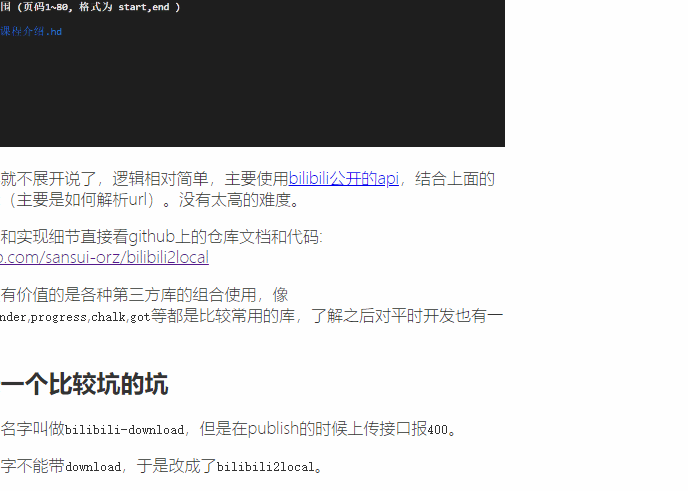

# 推荐两个实用工具

[tag]:工具|推荐|水
[create]:2022-06-09

最近工作比较忙，且生活上事情也多。再加上想不到要写点什么，就一直拖到现在。

想着既然如此，最近用两个软件挺好用的，就推荐给大家吧。

## 截图工具 - snipaste

这个是我一位同事分享给我的，平时用的都是聊天软件自带的截图功能。这个截图软件让我称道的只有一点，那就是可以把截图固定在屏幕上，彻底摆脱了截图想要对比查看只能保存到本地或者发送到聊天窗口的问题。

这个小小的优化功能，产品体验就天差地别。所以有时候开发做再多的性能优化，代码优化效果往往达不到预期，因为产品的功能本身存在缺陷。这也是我最近体会到作为开发的无力，往往决定产品走向的都不会是开发，可能是好的产品策划，也可能是一个好的活动运营或是一个突如其来的封口，而不太可能是开发。

下载链接(只有window的，目前用的window机开发，mac大家可以找找有没有类似的): <https://pan.baidu.com/s/17UlyB4eLdKPqIAJAZo3ZzQ?pwd=m7ba>

## gif图片录制

gif图片的录制往往也很有用，当你复现了一个bug，或者是给别人演示一个操作时，一个连续播放的动图比一份文档更加直观。我的博客里面的图片也有用这个软件录制的，效果很不错。

下载链接(同样只有window)： <https://pan.baidu.com/s/10QNVhzg2ql-XPm4jkiDJkg?pwd=ba5f>

## THE END

就这样，最近我想要撸一个window系统的open命令，无法简单的从命令行直接打开文件夹确实使我感觉很麻烦。