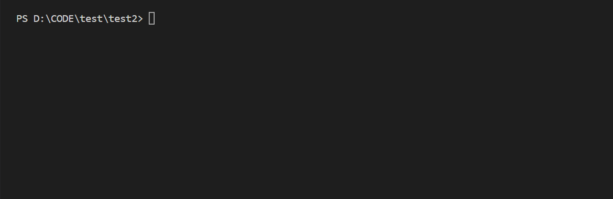

# 撸了一个b站视频下载命令行工具

[tag]:node|tool|bilibili
[create]:2022-04-21

最近在B站看一些编程视频，但是网络不佳，经常卡住。于是想要将视频下载下来本地观看，但是网上找了一圈都没有找到合适的方式下载。

最后参照一个可以下载单个视屏的[油猴脚本](https://greasyfork.org/zh-CN/scripts/390952)（不支持多p视屏的下载）进行改造，开发了一个命令行工具`bilibili2local`，主要优化了一下多p视频的下载，用以快速下载B站上的教程。
(ps：由于在阮一峰的博客投稿了，Start很快破了三百，担心会造成侵权的问题，已经关闭了，大家看看思路自己实现一下吧。

具体怎么搞得就不展开说了，逻辑相对简单，主要使用[bilibili公开的api](https://github.com/SocialSisterYi/bilibili-API-collect)，结合上面的油猴插件逻辑（主要是如何解析url，拿到视频ID进行递归下载）。没有太高的难度，但是下载的视频只有`flv`格式的，要转格式需要自己装个`ffmpeg`或者其他工具，当然可以直接下载个支持`flv`格式的播放器，如恒星播放器就很好用。

其实其中比较有价值的是各种第三方库的组合使用，像`inquirer`,`commander`,`progress`,`chalk`,`got`等都是比较常用的库，了解之后对平时开发也有一定帮助。

## 最后记录一个比较坑的坑

本来这个库的名字叫做`bilibili-download`，但是在publish的时候上传接口报`400`。

最后发现库名字不能带`download`，于是改成了`bilibili2local`。