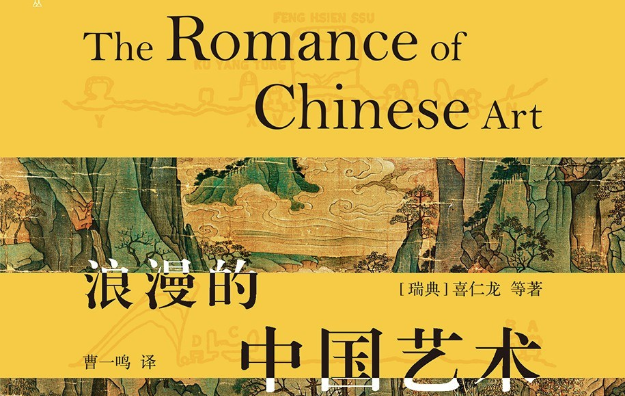

# 浪漫的中国艺术

[tag]:阅读|读后感
[create]:2023-11-21

最近在干很多事情，但是都还没有完成，并且难以述之以文字。思来想去，不如写一篇读后感，刚好最近看完了一本还不错的书 --《浪漫的中国艺术(The Romance of Chinese Art)》。

这本书是瑞典的艺术史家、汉学家、哲学博士[喜仁龙](https://book.douban.com/subject_search?search_text=%E5%96%9C%E4%BB%81%E9%BE%99%20%E7%AD%89)写的，其内容讨论了诸多形式的中国古代艺术，例如“绘画、陶瓷、雕塑、建筑、玉器、漆器、青铜、纺织”等。而每一品类又由不同的专业的艺术家、艺术史家撰写，对中国各艺术门类的发展历程，杰出代表作等娓娓道来，并附以大量图例展示，令人一目了然。

## 瓷器

就拿其中瓷器举例，瓷器是中国文化的重要代表，既是**china**，又是**China**。

但鲜有人知的是瓷器如何由陶器逐步演变而来？又是在何时才出现？其中瓷器又有多少种品类？

如**龙泉青瓷**，**定瓷**，**钧瓷**，**磁州窑**，**青花瓷**，**明代珐琅彩瓷**，**明代三彩瓷**，**绿地彩瓷**等，都是我国历史上曾盛行一时的瓷器，其发展历史蜿蜒曲折，不同时代的局势与政治对这些瓷器的形成都有着莫大的影响。

就如可能为众人所熟知的**景泰蓝**珐琅器具，其在中国的发展繁盛甚至可能是由于景泰年间土耳其人围攻君士坦丁堡，导致大量工匠四处逃散，其中不乏一部分优秀匠人逃到中国，客观上促进了明代珐琅艺术的繁荣。

## 建筑

中国古代建筑也非常的精彩，尤其是其中传统木结构的建筑，各个木构件之间累叠悬挑，一层接着一层，每一层都设斗拱以承托支撑梁或檩条下的替木。如同搭积木一般，利用木梁相互勾结形成支撑性力量架起整个木结构建筑，令人叹为观止。

## 绘画

除此之外的绘画，相对于西方的写实画风，其意境更加深远，线条构图等都更加飘逸流畅。如东晋顾恺之的《女史箴图》与《洛神赋图》，其中人物衣襟飘飘，展现了富有艺术想象力的诗意场景，很难想象在公元二三世纪的时候已经能产生如此优美的艺术并能保存至今。

## 其他

其他的艺术形式，如青铜，漆器，纺织，玉器等也令人大开眼界，可惜的是大部分优秀的历史文物都流失海外，书中的例子也大多数是全球各地的博物馆馆藏。

## 总结

这是一本优秀的总结归纳中国传统艺术的书籍，能够帮助阅读者系统性的了解中国艺术的发展以及其繁多的门类，使之对中国的艺术变迁有一定的了解。
虽然这可能不会给我们带来实际性的帮助，但是增长见识终归是一件益事。
不能总钻牛角尖，在繁忙的工作学习间隙，通过阅读一些自己未曾涉猎过的知识内容，开阔一下自己的视野，也更有益于身心健康。就是这样！