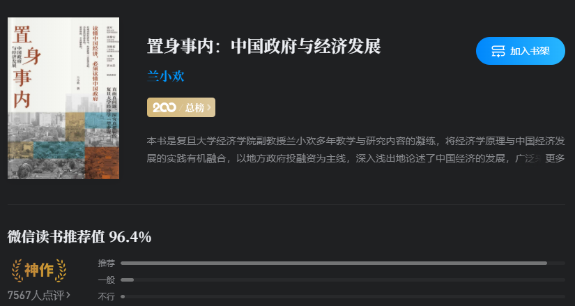

# 置身事内-中国政府与经济发展

[tag]:阅读|扩展|经济学
[create]:2022-03-16

> “我读书越多，书籍就使我和世界越接近，生活对我也变得越加光明和有意义” -- 高尔基

《置身事内：中国政府与经济发展》是我第一本读完的经济学相关的书籍，受益匪浅。

在新的一年里，开始关心粮食蔬菜、股票基金、政治政策，逐渐的从一个社会小白向一个成熟社会人转变，而学习一定的经济学知识就是我踏出的第一步。

## 为什么要读这本书，为什么要学一点经济学知识

我接触经济学是没带什么目的的，单纯只是为了开阔一下眼界，了解三餐和工作之外的其他社会面。

而要说经济学能给我带来什么收益，倒也不见得，甚至可能会让我的财产有一定的损失（开始买基金当韭菜）。

经济学不仅仅是经济上面的东西，我看到更多的是关于政治政策与民生。这些恰恰是我们每一个人都应该去了解的。

我们当今社会处在一个什么阶段？经济是什么情况？未来的规划是什么？这些事情我从来没有关心了解过，身边也从未有人讨论过相关话题。

有的仅仅是“中国GDP增速、房价连年暴涨、贷款利率提了多少”之类的CCTV式时讯，

其中原因大家都兴致索然，但其实这些种种表现背后的诱因才是能让我们理解这个社会的答案。了解后才知道原来大人们酒桌上的胡吹神侃真是错漏百出，或是略知皮毛，最终的本质还是落在了经济上。

当然，这些也都是我稍微补习了一些经济学知识之后才有这类的感叹，知识或许不能直接给我财富，但是确实是拓宽了我的眼界。

## 这本书大概讲了什么

这是一本专门讲述近代中国政治经济发展背景与历程的书，从中央及地方政府的职权划分，到财税中的“分税制改革，土地财政”，又扩展政府债务问题以及城市化与民生问题，最终讲发展与转型。

其中用到大量国内各大城市的真实案例，以及考究了大量的资料（论文，文章，书籍）。

最主要的是，其用通俗易懂语言，非常清晰给你描述自八九十年代以来中国经济高速发展模式下出现的种种现象以及其深层原因。可以说，整书的脉络其实就是中国近代经济发展的脉络。

如果随便在街上抓一个人问他“中国为什么在近二三十年经济能够高速发展？”，大概率会得到“因为改革开放”这个答案，若你再问一句“那改革开放具体做了什么呢？”。呵呵，可不能抱着得到答案的期望。

这本书可以很好的回答上面的那个问题。

## 最后

在我的年度目标中中有一条是”至少看完三本非技术，非小说的其他题材书籍“，这是第一本，设立这个目标的初衷是让自己的目光能够看到其他精彩的地方。