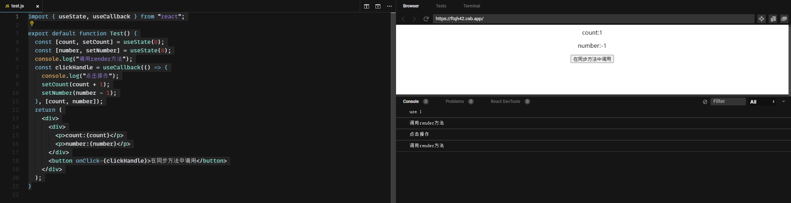
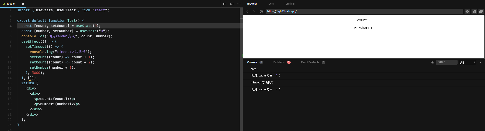
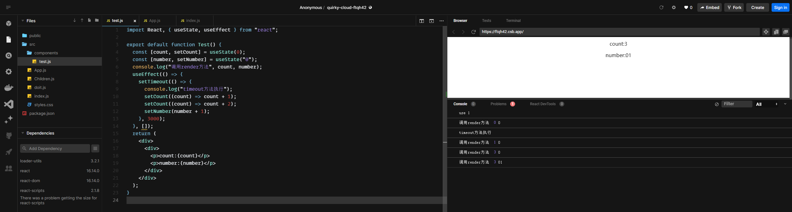
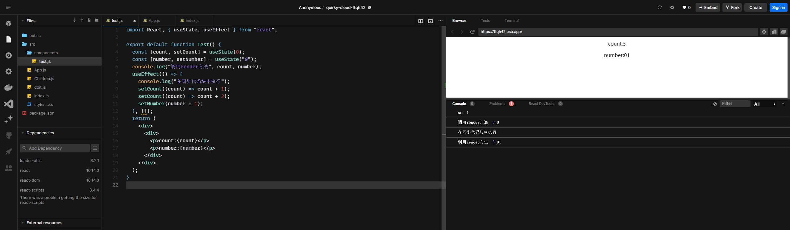
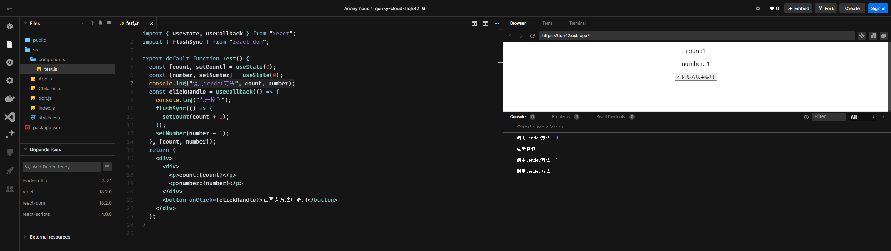

# 老生常谈-useState的同步异步问题

[tag]:react|ClassComponent|FunctionComponent
[create]:2023-01-07

在React Hooks出来之前，setState是同步的还是异步的就已经是一个老生常谈的话题，而函数组件已经可以完全取代类组件，所以这个老生常谈的问题又需要再次理清了，useState的set操作究竟是同步还是异步？

## 在同步方法中调用

调用方法如下:
```js
import { useState, useCallback } from "react";

export default function Test() {
  const [count, setCount] = useState(0);
  const [number, setNumber] = useState(0);
  console.log("调用render方法");
  const clickHandle = useCallback(() => {
    console.log("点击操作");
    setCount(count + 1);
    setNumber(number - 1);
  }, [count, number]);
  return (
    <div>
      <div>
        <p>count:{count}</p>
        <p>number:{number}</p>
      </div>
      <button onClick={clickHandle}>在同步方法中调用</button>
    </div>
  );
}
```

运行结果如下:


从结果来看，很明显可以看到同步修改了两个state，但是render函数仅执行了一次，所以在同步函数内调用，useState的set操作会合并成一次渲染，也就是此时setState是异步的

## 在异步方法中调用

调用方法如下:
```js
import { useState, useEffect } from "react";

export default function Test() {
  const [count, setCount] = useState(0);
  const [number, setNumber] = useState("0");
  console.log("调用render方法", count, number);
  useEffect(() => {
    setTimeout(() => {
      console.log("timeout方法执行");
      setCount((count) => count + 1);
      setCount((count) => count + 2);
      setNumber(number + 1);
    }, 3000);
  }, []);
  return (
    <div>
      <div>
        <p>count:{count}</p>
        <p>number:{number}</p>
      </div>
    </div>
  );
}
```

运行结果如下:


可以看到这里我们在异步代码块中，连续更改了三次state，但是最终也只render了一次。那么此时setState也是异步的。

## v16\v17 版本有所不同

但是需要额外注意的是，我们这里使用的react版本是18.2.0, 而如果使用的是16的版本，这里会有些不一样:



可以看到，在v16的版本中，我们在异步代码块中执行三次render，而对应render了三次。所以在16版本中（17版本同样如此），useState在异步代码中的更新时同步的，也就是一次updateState对应一次render。

- 上面是在异步代码块中执行的结果，而如果是同步代码块又会如何呢？



同步代码块中，useState更新跟v18版本是一样是异步的，多次更新会合并成一次render。

这也是v18版本中一个大的优化，要知道我们项目中不可或缺的API请求可是非常常见的，请求回来之后必然伴随着state的更新，而如果每次更新state都需要重新render一次的话，造成的性能损耗是很大的。

在2021年中公布的React 18 alpha版中，更新了新的ReactDOM api ReactDOM.createRoot。
同时也公布了新的auto batching机制。在auto batching下，无论是通过SyntheticEvent、原生event还是setTimeout等，任何调用setState的方式都是batching机制。

也就是说，React 18后，所有的setState都会是非同步的。

## v18版本如何同步更新?

v18后默认为所有的state更新启用批处理，但是也提供了一个[flushSync Api](https://react.dev/reference/react-dom/flushSync)支持同步更新。但是并不推荐使用，因为一般场景下确实用不到同步更新DOM，频繁的同步更新也会导致应用性能急速下降。

```js
import { useState, useCallback } from "react";
import { flushSync } from "react-dom";

export default function Test() {
  const [count, setCount] = useState(0);
  const [number, setNumber] = useState(0);
  console.log("调用render方法", count, number);
  const clickHandle = useCallback(() => {
    console.log("点击操作");
    flushSync(() => {
      // 函数内的state更新将被同步更新到dom
      setCount(count + 1);
    });
    setNumber(number - 1);
  }, [count, number]);
  return (
    <div>
      <div>
        <p>count:{count}</p>
        <p>number:{number}</p>
      </div>
      <button onClick={clickHandle}>在同步方法中调用</button>
    </div>
  );
}
```

运行结果:



## 参考:
[React useState和setState到底是同步还是异步呢？ -- v16文章](https://juejin.cn/post/6959885030063603743)
[bailing-out-of-a-state-update](https://legacy.reactjs.org/docs/hooks-reference.html#bailing-out-of-a-state-update)
[flushSync Api](https://react.dev/reference/react-dom/flushSync)